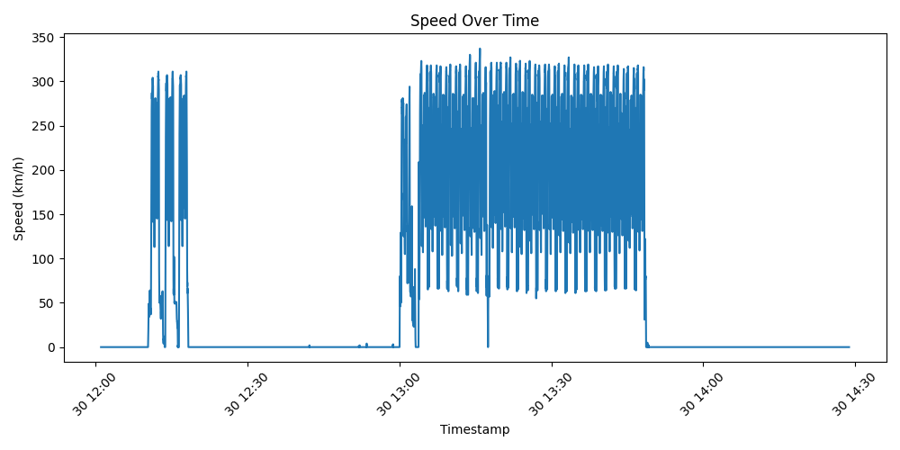
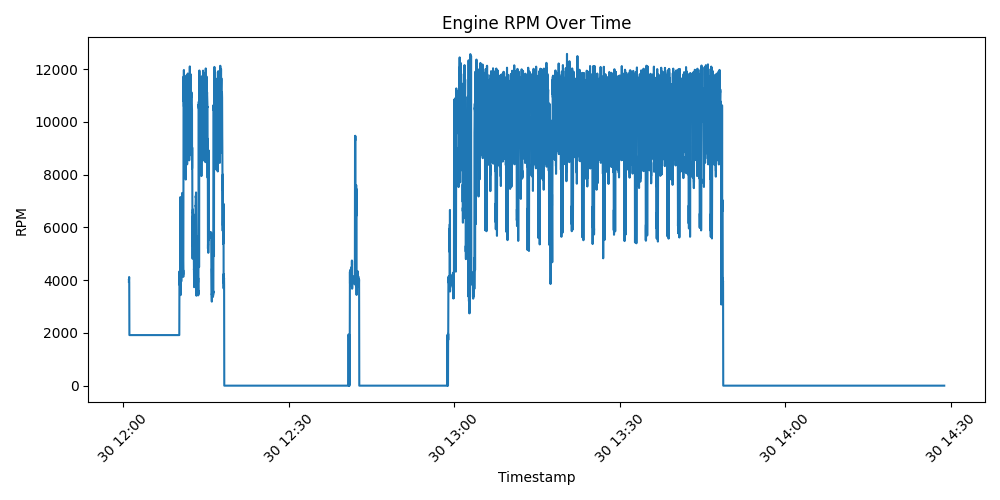

# Vehicle Telemetry Data Pipeline

End-to-end Python pipeline for ingesting, processing, and analyzing real Formula 1 telemetry data using the OpenF1 API.

## Key Features
- Ingest real telemetry data (speed, RPM, throttle, brake, gear)
- Clean and validate noisy time-series signals
- Compute derived metrics (acceleration, braking intensity)
- Detect braking events
- Generate analytical reports and plots
- Dockerized for reproducibility
- Automated with GitHub Actions

## Project Structure
```text
vehicle-telemetry-pipeline/
├─ data/
│  ├─ raw/
│  ├─ processed/
│  └─ reports/
├─ src/
├─ tests/
├─ .github/workflows/
├─ Dockerfile
├─ requirements.txt
├─ README.md
└─ run_pipeline.py
```

## Input Schema
Expected telemetry columns:
- timestamp
- speed_kmh
- engine_rpm
- throttle_pct
- brake
- gear

## How to Run
### Local
```bash
pip install -r requirements.txt
python run_pipeline.py
```

### Tests
```bash
python -m pytest
```

### Docker
```bash
docker build -t vehicle-telemetry-pipeline .
docker run --rm vehicle-telemetry-pipeline
```

## Example Output

- Processed telemetry dataset
- Detected braking events
- Summary metrics (average speed, max RPM, etc.)
- Time-series plots of speed and engine RPM




## Real Telemetry Integration

This project uses the OpenF1 API to fetch real Formula 1 telemetry data, including:
- Speed
- Engine RPM
- Throttle position
- Brake signal
- Gear selection

The pipeline normalizes and validates these signals before analysis.

## Future Improvements
- SQLite storage layer
- anomaly detection
- lap/session comparison
- dashboard visualization